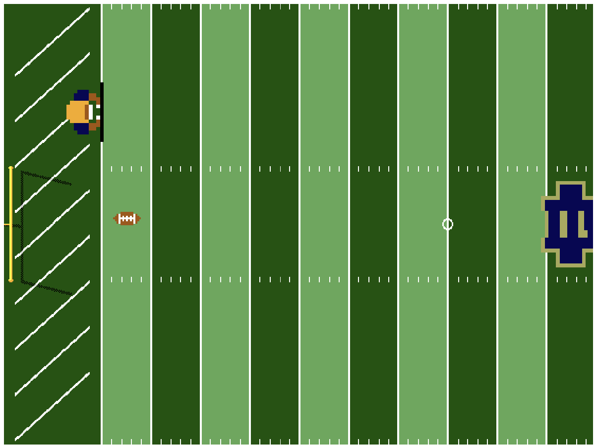

   

# Notre Dame Football ASIC

A single-player Pong game with a Notre Dame football theme, drawn on a 640x480 VGA screen and taped out on a real chip with Tiny Tapeout. You play a lineman holding a blocking pad on the goal line, and your goal is to keep the football from getting past you into the end zone.

This design is part of the [Tiny Tapeout TTSKY26d shuttle](https://app.tinytapeout.com/shuttles/ttsky26d).

- [Read the full documentation for the project](docs/info.md)

## Author

Evaristo Campos de Abreu Ribeiro, [LinkedIn](https://www.linkedin.com/in/evaristoribeiro)

## What is Tiny Tapeout?

Tiny Tapeout is an educational project that aims to make it easier and cheaper than ever to get your digital and analog designs manufactured on a real chip.

To learn more and get started, visit https://tinytapeout.com.

## How it works

The whole game is written in Verilog and turned into the chip's actual circuitry. There is no processor, software or firmware: the logic gates on the chip track the ball and the lineman and work out the color of every pixel as the VGA signal is sent to the screen, 60 times per second. The design will be fabricated using the open source [SKY130](https://github.com/google/skywater-pdk) 130 nm process (PDK).

On screen there is half of a football field seen from above: an end zone with a goal post, the field up to the 50, and the left half of the Notre Dame monogram at midfield. The football gets faster every time the lineman blocks it, and where he blocks it changes its angle.

## How to play

Connect the TinyVGA Pmod to the output pins and a VGA monitor. After reset, the ball is served right away. Play with two push buttons, with a SNES compatible controller on the Gamepad Pmod, or with both at the same time:

| Push button | Controller | Lineman   |
|-------------|------------|-----------|
| `ui_in[0]`  | D-pad Up   | Move up   |
| `ui_in[1]`  | D-pad Down | Move down |

The push buttons are active high: connect each one between VCC and its pin, with a pull-down resistor from the pin to GND.

## Hardware

- [TinyVGA Pmod](https://github.com/mole99/tiny-vga) on the output pins
- Optional: [Gamepad Pmod](https://github.com/psychogenic/gamepad-pmod) on `ui_in[6:4]`, with a SNES compatible controller
- Optional: two push buttons with pull-down resistors on `ui_in[0]` and `ui_in[1]`